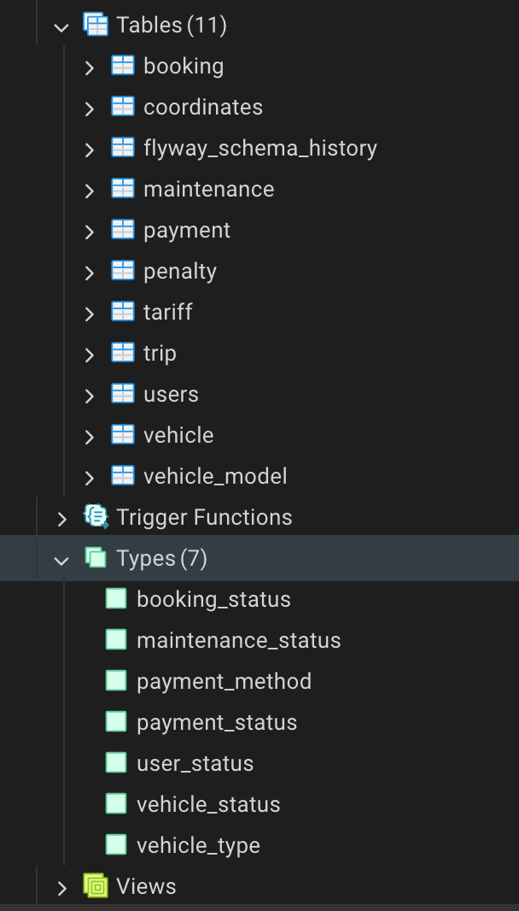
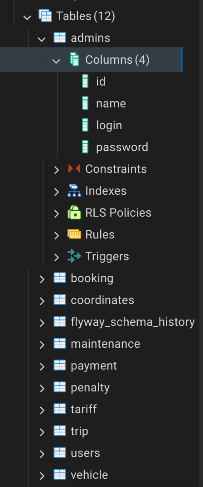
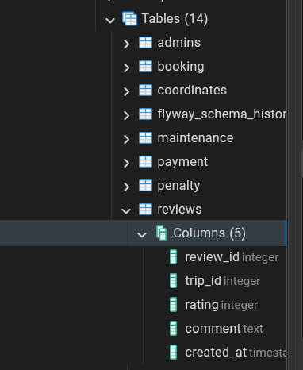
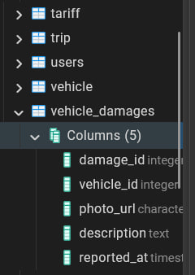
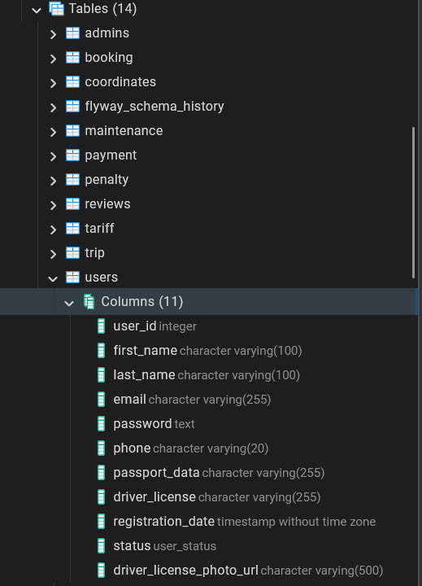
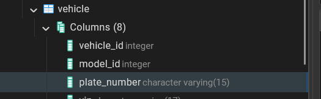

## Міграція V1: Ініціалізація схеми

**Файл:** [`V1__init_schema.sql`](src/main/resources/db/migration/V1__init_schema.sql)

**Опис:** Створення початкової структури бази даних

**Результат:**



-----

## Міграція V2: Додавання нової таблиці

**Файл:** [`V2__create_admin_table.sql`](src/main/resources/db/migration/V2__add_review_table.sql)

**Опис:** Створено таблицю `admins` для зберігання облікових записів адмінісраторів

**SQL:**

```sql
CREATE TABLE admins (
    id SERIAL PRIMARY KEY,
    name VARCHAR(255) NOT NULL,
    login VARCHAR(255) UNIQUE NOT NULL,
    password VARCHAR(255) NOT NULL
);
```

**Результат:**



-----

## Міграція V3: Створення таблиці відгуків

**Файл:** [`V3__review_table.sql`](src/main/resources/db/migration/V3__review_table.sql)

**Опис:** Створено таблицю `reviews` для зберігання відгуків про поїздки. Кожна поїздка може мати один відгук з рейтингом від 1 до 5 та опціональним коментарем.

**SQL:**

```sql
CREATE TABLE reviews (
    review_id SERIAL PRIMARY KEY,
    trip_id INT NOT NULL UNIQUE REFERENCES trip(trip_id) ON DELETE CASCADE,
    rating INT NOT NULL CHECK (rating BETWEEN 1 AND 5),
    comment TEXT,
    created_at TIMESTAMP NOT NULL DEFAULT CURRENT_TIMESTAMP
);
```

**Результат:**



-----

## Міграція V4: Оновлення користувачів та транспортних засобів, створення таблиці пошкоджень

**Файл:** [`V4__vehicle_damage.sql`](src/main/resources/db/migration/V4__vehicle_damage.sql)

**Опис:** 
- Додано поле `driver_license_photo_url` до таблиці `users` для зберігання URL фотографії водійського посвідчення
- Змінено тип колонки `plate_number` в таблиці `vehicle` на `VARCHAR(15)` та оновлено обмеження для формату номерного знака (тепер дозволяє формат `^[A-Z0-9-]{4,15}$`)
- Створено таблицю `vehicle_damages` для відстеження пошкоджень транспортних засобів з фотографіями та описом

**SQL:**

```sql
ALTER TABLE users 
ADD COLUMN driver_license_photo_url VARCHAR(500);

ALTER TABLE vehicle 
ALTER COLUMN plate_number TYPE VARCHAR(15);

ALTER TABLE vehicle 
DROP CONSTRAINT vehicle_plate_number_check;

ALTER TABLE vehicle 
ADD CONSTRAINT vehicle_plate_number_check 
CHECK (plate_number ~ '^[A-Z0-9-]{4,15}$');

CREATE TABLE vehicle_damages (
    damage_id SERIAL PRIMARY KEY,
    vehicle_id INT NOT NULL REFERENCES vehicle(vehicle_id),
    photo_url VARCHAR(500) NOT NULL,
    description TEXT,
    reported_at TIMESTAMP DEFAULT CURRENT_TIMESTAMP
);
```

**Результат:**






